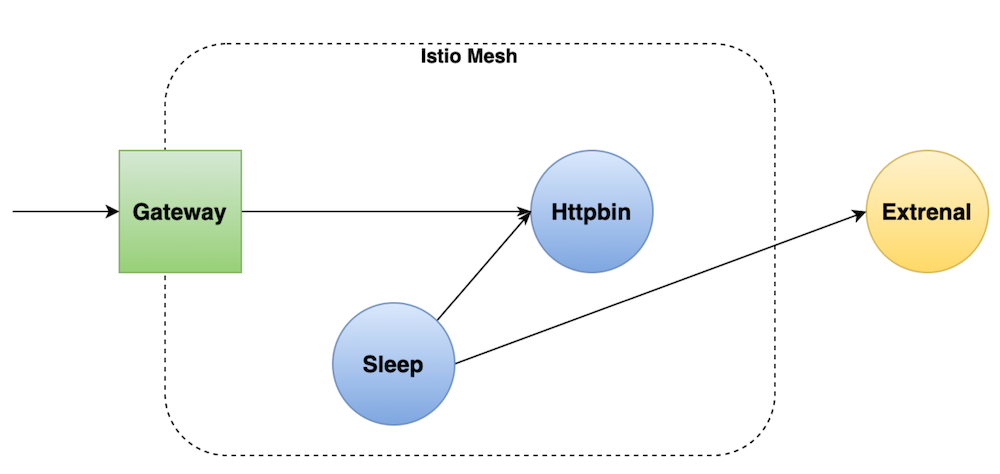

# istio-demo



## Init env

- Flux

  ```
  # Install flux client
  brew install fluxcd/tap/flux

  # Check k8s cluster
  flux check --pre

  # Export your credentials
  export GITHUB_TOKEN=<your-token>
  export GITHUB_USER=<your-username>

  # Setup Flux onto k8s cluster
  flux bootstrap github \
    --owner=$GITHUB_USER \
    --repository=istio-demo \
    --branch=main \
    --path=./flux \
    --personal
  ```

- Demo

  ```
  # Create namespace for demo
  kubectl create ns demo

  # Commit demo manifests into repo so that flux could manage the deployment.
  gaa
  gcmsg "Add demo manifests"
  gp
  ```
