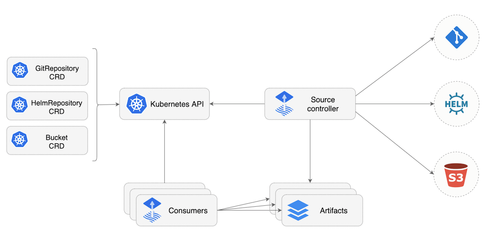

# istio-demo



## Init env

- Flux

  ```
  # Install fluxctl
  brew install fluxctl

  # Deploy flux
  kubectl apply -f flux/

  # Set git config
  fluxctl install \
    --git-user=showerlee \
    --git-email=showerlee@vip.qq.com \
    --git-url=git@github.com:showerlee/istio-demo.git \
    --namespace=flux | kubectl apply -f -
  
  # Get deploy key
  fluxctl identity --k8s-fwd-ns flux
  ssh-rsa xxxxxxxxx

  # Upload ssh-rsa to deploy key with write access in GIthub
  ```

- Demo

  ```
  # Create namespace for demo
  kubectl create ns demo
  
  ```
