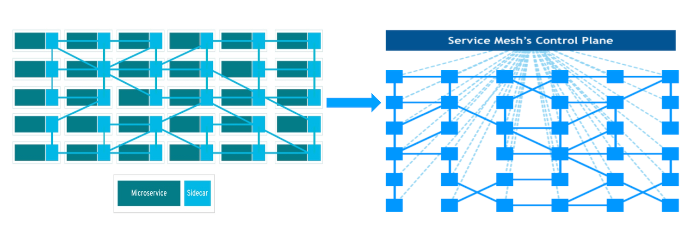
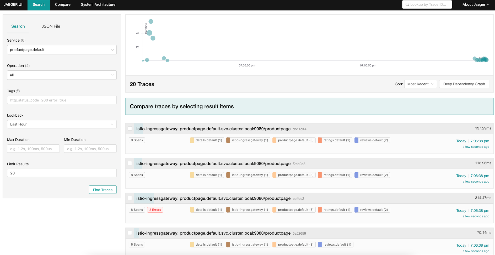
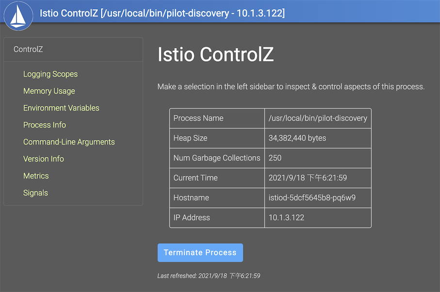
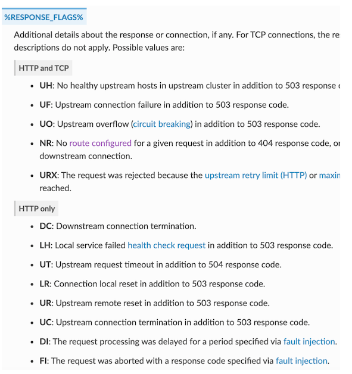

# istio-demo
A simple demo that helps you build micro service via istio framework in k8s.

## Context

### What is service mesh?

A service mesh is a dedicated infrastructure layer for handling service-to-service communication. It’s responsible for the reliable delivery of requests through the complex topology of services that comprise a modern, cloud native application. In practice, the service mesh is typically implemented as an array of lightweight network proxies that are deployed alongside application code, without the application needing to be aware



### Feature

- Traffic control
  - Routing
  - Traffic transfer
  - Timeout retry
  - Circuit breaking
  - Fault injection
  - Traffic mirroring

- Policy
  - Traffic limit
  - Black/white list

- Network security
  - Authentication
  - Authorization

- Observability
  - Indicator collection and display
  - Logging collection
  - Distributed tracing

### What is istio?

It is a completely open source service mesh that is connected to existing distributed applications as a transparent layer.

It is also a platform that can be integrated with any logging, telemetry and policy system. Istio's diverse features allow you to successfully and efficiently run a microservice architecture, and provide a unified method for protecting, connecting, and monitoring microservices.


### Why we choose istio?

- Traffic management
- Observability
- Security capabilities

More details: https://istio.io/latest/docs/

## How it works

We will create the following micrio services via GitOps to demonstrate how to achieve the traffic management, observability and security capabilities in `Istio Mesh`


- `Gateway` is a network ingress receives any vaild inbound traffic and forwards to internal services.

- [Httpbin](https://httpbin.org/) is a simple HTTP Request & Response Service.

- `Sleep` is a client that initiates a internal network request.

- `External` means any outbound traffic going outside `Istio Mesh`

### Prerequisite

[Setup-istio-in-docker-desktop](https://github.com/showerlee/k8s_tutorial/blob/master/manifests/istio/istioctl/README.md#setup-istio-in-docker-desktop)

### GitOps deployment via Flux

[Flux](https://fluxcd.io/docs/) helps you deploy istio resources via [GitOps](https://www.gitops.tech/#what-is-gitops) without any manual execution.


- [Flux](https://fluxcd.io/docs/components/source/)

  ```
  # Install flux client
  brew install fluxcd/tap/flux

  # Check k8s cluster
  flux check --pre

  # Export your credentials
  export GITHUB_TOKEN=<your-token>
  export GITHUB_USER=<your-username>

  # Setup Flux onto k8s cluster
  flux bootstrap github \
    --owner=$GITHUB_USER \
    --repository=istio-demo \
    --branch=main \
    --path=./flux \
    --personal
  ```

- Demo

  ```
  # Create namespace for demo
  kubectl create ns demo

  # Commit demo manifests into repo so that flux could manage the deployment.
  git add demo/
  gcmsg "Add demo manifests"
  git push

  # Inject side car for namespace demo
  kubectl label namespace demo istio-injection=enabled --overwrite=true

  # Export the manifest of demo source git for flux
  flux create source git demo \
    --url=https://github.com/showerlee/istio-demo \
    --branch=main \
    --interval=30s \
    --export > ./flux/demo-source.yaml
  
  # Commit and push demo-source.yaml to flux base dir:
  git add -A && git commit -m "Add demo GitRepository"
  git push

  # Export the manifest of demo deployment for flux
  flux create kustomization demo \
    --source=demo \
    --path="./demo" \
    --prune=true \
    --validation=client \
    --interval=5m \
    --export > ./flux/demo-kustomization.yaml

  # Commit and push demo-source.yaml to flux base dir:
  git add -A && git commit -m "Add demo Kustomization"
  git push

  # Check all resources in demo namespace
  kubectl get all -n demo
  NAME                           READY   STATUS    RESTARTS   AGE
  pod/httpbin-74fb669cc6-8kbzh   2/2     Running   0          9m1s
  pod/sleep-854565cb79-2vdrl     1/1     Running   0          53m

  NAME              TYPE        CLUSTER-IP     EXTERNAL-IP   PORT(S)    AGE
  service/httpbin   ClusterIP   10.101.24.23   <none>        8000/TCP   9m1s
  service/sleep     ClusterIP   10.111.29.70   <none>        80/TCP     62m

  NAME                      READY   UP-TO-DATE   AVAILABLE   AGE
  deployment.apps/httpbin   1/1     1            1           9m1s
  deployment.apps/sleep     1/1     1            1           53m

  NAME                                 DESIRED   CURRENT   READY   AGE
  replicaset.apps/httpbin-74fb669cc6   1         1         1       9m1s
  replicaset.apps/sleep-854565cb79     1         1         1       53m

  # Check the connection between sleep and httpbin
  kubectl exec -it -n demo sleep-854565cb79-2vdrl -c sleep -- curl http://httpbin.demo:8000/ip
  {
    "origin": "10.1.1.71"
  }

  ```

### Canary release via Flagger


- Flagger

  ```
  # Install flagger CRD
  kubectl apply -f flagger/crd.yaml

  # Check flagger CRD
  kubectl get crd | grep flagger

  # Add Flagger helm repo
  helm repo add flagger https://flagger.app

  # Deploy flagger with istio
  helm upgrade -i flagger flagger/flagger \
    --namespace=istio-system \
    --set crd.create=false \
    --set meshProvider=istio \
    --set metricsServer=http://prometheus.istio-system:9090

  # Create a test Slack workspace and Flagger APP for webhook
  https://api.slack.com/messaging/webhooks

  # Add slack webhook for flagger
  helm upgrade -i flagger flagger/flagger \
    --namespace=istio-system \
    --set crd.create=false \
    --set slack.url=xxx \
    --set slack.channel=istio-demo \
    --set slack.user=Flagger

  # Add grafana for flagger dashboard
  helm upgrade -i flagger-grafana flagger/grafana \
    --namespace=istio-system \
    --set url=http://prometheus.istio-system:9090 \
    --set user=admin \
    --set password=admin

  # Check the outcome
  kubectl get pods -n istio-system
  NAME                                    READY   STATUS    RESTARTS   AGE
  flagger-6d6fcd75cc-wvktw                1/1     Running   0          4m54s
  flagger-grafana-77b8c8df65-9gbkh        1/1     Running   0          83s
  grafana-5b865d9cfb-vz2tn                1/1     Running   0          2d23h
  istio-egressgateway-5dcd5999f4-qffwh    1/1     Running   0          2d23h
  istio-ingressgateway-7d754985d5-dcgwx   1/1     Running   0          2d23h
  istiod-66755bc76c-ksgjq                 1/1     Running   0          2d23h
  jaeger-99b4cd9bb-bs8tz                  1/1     Running   0          2d23h
  kiali-6f5f6d4bbd-fptkf                  1/1     Running   0          2d23h
  prometheus-5b96c5d456-mw957             3/3     Running   0          2d23h

  # Create istio ingress gateway
  kubectl apply -f flagger/istio-gateway.yaml

  # Deploy flagger loadtester in demo namespace
  https://github.com/fluxcd/flagger/tree/main/kustomize/tester

  kubectl apply -f flagger/tester-deployment.yaml -n demo
  kubectl apply -f flagger/tester-svc.yaml -n demo

  # Create hpa for httpbin
  kubectl apply -f flagger/hpa.yaml

  # Create latency metric for prometheus
  kubectl apply -f flagger/latency-template.yaml

  # Add host in local
  sudo echo "127.0.0.1 httpbin.example.com" /etc/hosts

  # Create canary analysis
  kubectl apply -f flagger/canary.yaml

  # Simulate the request for httpbin
  kubectl exec -it -n demo sleep-854565cb79-2vdrl -c sleep sh
  while [ 1 ]; do curl http://httpbin.demo:8000/headers;sleep 2s; done
  {
    "headers": {
      "Accept": "*/*",
      "Host": "httpbin.demo:8000",
      "User-Agent": "curl/7.77.0",
      "X-B3-Sampled": "0",
      "X-B3-Spanid": "c79b98a968ef9954",
      "X-B3-Traceid": "281e285c1e9c5f49c79b98a968ef9954"
    }
  }
  {
    "headers": {
      "Accept": "*/*",
      "Host": "httpbin.demo:8000",
      "User-Agent": "curl/7.77.0",
      "X-B3-Sampled": "0",
      "X-B3-Spanid": "685e339a26b0b414",
      "X-B3-Traceid": "3f32d3f1991e298f685e339a26b0b414"
    }
  }
  ...

  # Check canary analysis
  kubectl get canary -n demo
  NAME      STATUS         WEIGHT   LASTTRANSITIONTIME
  httpbin   Initializing   0        2021-09-07T14:21:52Z

  # Check all resources that canary done for demo
  kubectl get all -n demo
  NAME                                      READY   STATUS    RESTARTS   AGE
  pod/flagger-loadtester-57856ccd69-6bzk9   1/1     Running   0          32m
  pod/httpbin-primary-fcbdd7f6b-4ffz2       2/2     Running   0          52s
  pod/httpbin-primary-fcbdd7f6b-qmchh       2/2     Running   0          8m22s
  pod/sleep-854565cb79-2vdrl                1/1     Running   0          2d10h

  NAME                         TYPE        CLUSTER-IP       EXTERNAL-IP   PORT(S)    AGE
  service/flagger-loadtester   ClusterIP   10.104.130.51    <none>        80/TCP     32m
  service/httpbin              ClusterIP   10.101.24.23     <none>        8000/TCP   2d10h
  service/httpbin-canary       ClusterIP   10.102.6.228     <none>        8000/TCP   8m22s
  service/httpbin-primary      ClusterIP   10.107.153.184   <none>        8000/TCP   8m22s
  service/sleep                ClusterIP   10.111.29.70     <none>        80/TCP     2d10h

  NAME                                 READY   UP-TO-DATE   AVAILABLE   AGE
  deployment.apps/flagger-loadtester   1/1     1            1           32m
  deployment.apps/httpbin              0/0     0            0           2d10h
  deployment.apps/httpbin-primary      2/2     2            2           8m22s
  deployment.apps/sleep                1/1     1            1           2d10h

  NAME                                            DESIRED   CURRENT   READY   AGE
  replicaset.apps/flagger-loadtester-57856ccd69   1         1         1       32m
  replicaset.apps/httpbin-74fb669cc6              0         0         0       2d10h
  replicaset.apps/httpbin-primary-fcbdd7f6b       2         2         2       8m22s
  replicaset.apps/sleep-854565cb79                1         1         1       2d10h

  NAME                                                  REFERENCE                    TARGETS         MINPODS   MAXPODS   REPLICAS   AGE
  horizontalpodautoscaler.autoscaling/httpbin           Deployment/httpbin           <unknown>/99%   2         4         0          2m20s
  horizontalpodautoscaler.autoscaling/httpbin-primary   Deployment/httpbin-primary   <unknown>/99%   2         4         1          112s

  NAME                         STATUS        WEIGHT   LASTTRANSITIONTIME
  canary.flagger.app/httpbin   Initialized   0        2021-09-07T14:48:38Z

  # Release httpbin test version for canary deployment
  Change the httpbin image version to test in `demo/httpbin.yaml` and commit the change for flux deployment

  # Check canary events
  kubectl describe canary -n demo
  Events:
  Type     Reason  Age                   From     Message
  ----     ------  ----                  ----     -------
  Normal   Synced  113s (x2 over 20m)  flagger  New revision detected! Scaling up httpbin.demo
  Warning  Synced  83s                 flagger  canary deployment httpbin.demo not ready: waiting for rollout to finish: 1 old replicas are pending termination
  Normal   Synced  53s (x2 over 19m)   flagger  Starting canary analysis for httpbin.demo
  Normal   Synced  106s (x4 over 37m)   flagger  Advance httpbin.demo canary weight 20

  # Check if virtual service starting switching traffic
  kubectl describe vs httpbin -n demo
  ...
    Http:
    Route:
      Destination:
        Host:  httpbin-primary
      Weight:  80
      Destination:
        Host:  httpbin-canary
      Weight:  20
  ...

  # Check canary result(refer to the canary release is switching sucessfully)
  kubectl get canary -n demo
  NAME                         STATUS      WEIGHT   LASTTRANSITIONTIME
  canary.flagger.app/httpbin   Succeeded   0        2021-09-07T16:31:31Z

  # Check grafana dashboard for canary
  kubectl port-forward -n istio-system svc/flagger-grafana 3000:80

  Visit localhost:3000
  ```


### Improve the flexibility of the system


```
# Get virtualservice
kubectl get virtualservice -n demo
NAME      GATEWAYS                                    HOSTS                               AGE
httpbin   ["public-gateway.demo.svc.cluster.local"]   ["httpbin.example.com"]             134m

Visit httpbin.example.com should display a httpbin demo frontend

# Create a new gateway for demo
kubectl apply -f istio/gateway.yaml

# Create a virtualservice for 1s timeout
kubectl apply -f istio/vs-timeout.yaml

# Simulate 2s delay for httpbin to expect a request timeout where the timeout threshold is 1s
curl http://httpbin.demo.example.com/delay/2
upstream request timeout%

# Create a VS for retry
kubectl apply -f istio/vs-retry.yaml

# Simulate a 500 request for httpbin to expect a retry action from logs
curl http://httpbin.demo.example.com/status/500

# Check `istio-proxy` container in httpbin whether a retry is triggered
kubectl logs -n demo httpbin-primary-77b74656cf-gzh7j -c istio-proxy -f

# Simulate a Circuit breaking for httpbin
kubectl apply -f istio/cb.yaml

# Setup loadtest via `fortio`
kubectl apply -f istio/fortio-deploy.yaml
FORTIO_POD=$(kubectl get pod -n demo | grep fortio | awk '{print $1}')

# Request 3 concurrencies and 30 times
kubectl exec -it -n demo "$FORTIO_POD" -c fortio -- /usr/bin/fortio load -c 3 -qps 0 -n 30 -loglevel Warning http://httpbin.demo:8000/get
...
Code 200 : 14 (46.7 %)
Code 503 : 16 (53.3 %)
...
It implies 16(53.3% of) requests in 3 concurrencies and 30 times is blocked by Circuit breaking

# Check the fortio report
kubectl exec -n demo $FORTIO_POD -c istio-proxy -- pilot-agent request GET stats | grep httpbin.demo | grep pending
...
cluster.outbound|8000||httpbin.demo.svc.cluster.local.upstream_rq_pending_overflow: 16
cluster.outbound|8000||httpbin.demo.svc.cluster.local.upstream_rq_pending_total: 14

It gives the report that upstream_rq_pending_overflow is 16
```

### Setup secure policy


```
# Apply default policy(implicitly deny everything)
kubectl apply -f istio/ap-default.yaml

# Check whether request is deny
kubectl exec -it -n demo sleep-65c4679954-b955q -c sleep -- curl http://httpbin.demo:8000/get
RBAC: access denied

# Apply the policy where source namespace is demo
kubectl apply -f istio/ap-ns-demo.yaml

# Check if the accessiability is allowable where source namespace is demo and serviceaccount is sleep
kubectl exec -it -n demo sleep-65c4679954-b955q -c sleep -- curl http://httpbin.demo:8000/get
{"args":{},"headers":{"Accept":"*/*","Host":"httpbin.demo:8000","User-Agent":"curl/7.77.0","X-B3-Parentspanid":"e76a692f21e8c12e","X-B3-Sampled":"1","X-B3-Spanid":"a09b92f9128c4da3","X-B3-Traceid":"b804435ac4f79773e76a692f21e8c12e","X-Envoy-Attempt-Count":"1","X-Forwarded-Client-Cert":"By=spiffe://cluster.local/ns/demo/sa/httpbin;Hash=709cb97c88a409eee19553dc269d44849a4c31a59fb9114368b7f391fed95357;Subject=\"\";URI=spiffe://cluster.local/ns/demo/sa/sleep"},"origin":"127.0.0.6","url":"http://httpbin.demo:8000/get"}

kubectl exec -it sleep-854565cb79-5kczn -c sleep -- curl http://httpbin.demo:8000/get
RBAC: access denied%

# Apply the policy where source namespace is demo and destination operation is GET
kubectl apply -f istio/ap-ns-demo-get.yaml

# Check if the accessiability is allowable where source namespace is demo and serviceaccount is sleep and destination operation is GET
kubectl exec -it -n demo sleep-65c4679954-b955q -c sleep -- curl http://httpbin.demo:8000/get
{"args":{},"headers":{"Accept":"*/*","Host":"httpbin.demo:8000","User-Agent":"curl/7.77.0","X-B3-Parentspanid":"d97f06ddbe825330","X-B3-Sampled":"1","X-B3-Spanid":"e3aaefd18964854a","X-B3-Traceid":"2d0be3e03d5129f8d97f06ddbe825330","X-Envoy-Attempt-Count":"1","X-Forwarded-Client-Cert":"By=spiffe://cluster.local/ns/demo/sa/httpbin;Hash=709cb97c88a409eee19553dc269d44849a4c31a59fb9114368b7f391fed95357;Subject=\"\";URI=spiffe://cluster.local/ns/demo/sa/sleep"},"origin":"127.0.0.6","url":"http://httpbin.demo:8000/get"}

kubectl exec -it -n demo sleep-65c4679954-b955q -c sleep -- curl http://httpbin.demo:8000/headers
RBAC: access denied%

# Apply the policy where source namespace is demo and destination operation is GET and have proper headers
kubectl apply -f istio/ap-ns-demo-get-hds.yaml

# Check if the accessiability is allowable where source namespace is demo and serviceaccount is sleep and destination operation is GET and request.headers contains test string
kubectl exec -it -n demo sleep-65c4679954-b955q -c sleep -- curl http://httpbin.demo:8000/get
RBAC: access denied%

kubectl exec -it -n demo sleep-65c4679954-b955q -c sleep -- curl http://httpbin.demo:8000/get -H x-rfma-token:test1
{"args":{},"headers":{"Accept":"*/*","Host":"httpbin.demo:8000","User-Agent":"curl/7.77.0","X-B3-Parentspanid":"8a1b87146fc7c68e","X-B3-Sampled":"1","X-B3-Spanid":"8d68039464aef8d9","X-B3-Traceid":"2c0d9693b50fdf048a1b87146fc7c68e","X-Envoy-Attempt-Count":"1","X-Forwarded-Client-Cert":"By=spiffe://cluster.local/ns/demo/sa/httpbin;Hash=709cb97c88a409eee19553dc269d44849a4c31a59fb9114368b7f391fed95357;Subject=\"\";URI=spiffe://cluster.local/ns/demo/sa/sleep","X-Rfma-Token":"test1"},"origin":"127.0.0.6","url":"http://httpbin.demo:8000/get"}

```

### Collect metrics and monitor applications

```
# Visit prometheus
istioctl d prometheus

# Check envoy interface is workable
kubectl exec -it -n demo sleep-596dd95b6d-478sx -c sleep -- curl http://httpbin.demo:15090/stats/prometheus
...
envoy_cluster_assignment_stale{cluster_name="xds-grpc"} 0
...

# Visit grafana
istioctl d grafana
```

### Logging via ELK


```
# Create a new namespace for elk
kubectl create ns elk

# Setup ELK
kubectl apply -f elk/

# Check filebeat logs for validation
kubectl logs -n elk filebeat-8646b847b7-vzp42
...
2021-09-14T08:02:20.179Z	INFO	log/harvester.go:251	Harvester started for file: /var/log/containers/httpbin-5f54b6d56f-pf5m2_demo_httpbin-5f5d90d59e826546d3c7f61a7adbdbc3f3eaccc08e7c047d1f92bde7e8af043c.log
...

# Setup log index in kibana

```

### Integrate distributed tracing tool

We use cloud native tool `jaeger` to integrate distributed tracing toll with istio.
You can choose `SkyWalking` and `DataDog` for the alternative.

```
# Setup Jaeger crd
kubectl apply -f jaeger/jaegertracing.io_jaegers_crd.yaml

# Create namespace
kubectl create ns observability

# Install operator
kubectl create -n observability -f jaeger/service_account.yaml
kubectl create -n observability -f jaeger/role.yaml
kubectl create -n observability -f jaeger/role_binding.yaml
kubectl create -n observability -f jaeger/operator.yaml

# Install cluster role
kubectl create -n observability -f jaeger/cluster_role.yaml
kubectl create -n observability -f jaeger/cluster_role_binding.yaml

# Apply jaeger
kubectl apply -f jaeger/simplest.yaml -n observability

# Get all resources in observability
kubectl get all -n observability
NAME                                   READY   STATUS    RESTARTS   AGE
pod/jaeger-operator-865868754b-bfpsv   1/1     Running   0          55m
pod/simplest-5675c68699-bfjn7          1/1     Running   0          111s

NAME                                  TYPE        CLUSTER-IP       EXTERNAL-IP   PORT(S)                                  AGE
service/jaeger-operator-metrics       ClusterIP   10.104.174.207   <none>        8383/TCP,8686/TCP                        54m
service/simplest-agent                ClusterIP   None             <none>        5775/UDP,5778/TCP,6831/UDP,6832/UDP      111s
service/simplest-collector            ClusterIP   10.103.221.89    <none>        9411/TCP,14250/TCP,14267/TCP,14268/TCP   111s
service/simplest-collector-headless   ClusterIP   None             <none>        9411/TCP,14250/TCP,14267/TCP,14268/TCP   111s
service/simplest-query                ClusterIP   10.107.13.208    <none>        16686/TCP,16685/TCP                      111s

NAME                              READY   UP-TO-DATE   AVAILABLE   AGE
deployment.apps/jaeger-operator   1/1     1            1           55m
deployment.apps/simplest          1/1     1            1           111s

NAME                                         DESIRED   CURRENT   READY   AGE
replicaset.apps/jaeger-operator-865868754b   1         1         1       55m
replicaset.apps/simplest-5675c68699          1         1         1       111s

# Integrate istio
istioctl manifest generate \
--set meshConfig.outboundTrafficPolicy.mode=REGISTRY_ONLY \
--set meshConfig.accessLogFile=/dev/stdout \
--set meshConfig.accessLogEncoding=JSON \
--set meshConfig.enableTracing=true \
--set meshConfig.defaultConfig.tracing.zipkin.address=simplest-collector.observability:9411 \
--set meshConfig.defaultConfig.tracing.sampling=100 \
> ./jaeger/generated-manifest.yaml
kubectl apply -f ./jaeger/generated-manifest.yaml

# Deploy bookinfo with istio and jaeger
kubectl apply -f jaeger/bookinfo.yaml
kubectl apply -f jaeger/bookinfo-gateway.yaml
kubectl label namespace default istio-injection=enabled --overwrite=true
kubectl -n default rollout restart deploy

# Check if productpage-v1 has three containers(since we injected jaeger in bookinfo manifest)
kubectl get pods
NAME                             READY   STATUS    RESTARTS   AGE
details-v1-794898d6c4-fsvk7      2/2     Running   0          11m
productpage-v1-89dc8876b-j92t5   3/3     Running   0          7m54s
ratings-v1-65bd969546-9szjp      2/2     Running   0          11m
reviews-v1-c769cb8bb-jvrfz       2/2     Running   0          11m
reviews-v2-5d56cb44bb-2p27g      2/2     Running   0          11m
reviews-v3-78cdd975cd-fv8s4      2/2     Running   0          11m
sleep-bf945dc74-m224z            2/2     Running   0          11m

# Forward query dashboard to local
kubectl port-forward svc/simplest-query -n observability 16686:16686
```
Visit http://localhost/productpage to produce more traffic for bookinfo.

Visit localhost:16686 to check if jaeger collects any tracing.



## Troubleshooting

Since it is an open source project and doesn't have any paid service for any emergency assistance. We need to find ways to rescue ourselves if no one could help.

Here is a few checklist:

### Istio CLI

```
# Verify env before installation
istioctl verify-install

# Manifest operation
istioctl manifest [apply/diff/generate/migrate/versions]

# Profile operation
istioctl profile [list/diff/dump]

# Inject istio-proxy sidecar
istioctl kube-inject

# Port forward dashboard in local and open
istioctl dashboard [controlz/envoy/Grafana/jaeger/kiali/Prometheus/zipkin]

# Proxy sync status check
istioctl ps

# Retrieve information about proxy configuration from an Envoy instance.
istioctl proxy-config <clusters|listeners|routes|endpoints|bootstrap|log|secret> <pod-name[.namespace]>
Example:
istioctl pc cluster productpage-v1-89dc8876b-j92t5

# Check all the details for pod embed istio
istioctl x describe pod httpbin-primary-6cb7cd85f8-7b9xp -n demo
Pod: httpbin-primary-6cb7cd85f8-7b9xp
   Pod Ports: 80 (httpbin), 15090 (istio-proxy)
--------------------
Service: httpbin
   Port: http 8000/HTTP targets pod port 80
DestinationRule: httpbin for "httpbin"
   connection pool/outlier detection
--------------------
Service: httpbin-primary
   Port: http 8000/HTTP targets pod port 80
DestinationRule: httpbin-primary for "httpbin-primary"
   No Traffic Policy


Exposed on Ingress Gateway http://
VirtualService: httpbin-demo
   1 HTTP route(s)
--------------------

Exposed on Ingress Gateway http://
VirtualService: httpbin
   Weight 100%

# Analyze istioctl regulations
istioctl analyze --all-namespaces
...

istioctl analyze a.yaml b.yaml target-dir/

istioctl analyze --use-kube=false a.yaml

```

### ControlZ tool

Self inspection for pilotd

- Adjust log output standard

- Check memory usage

- Env variable

- Process info

```
istioctl d controlz <istiod-podname> -n istio-system

istioctl d controlz istiod-5dcf5645b8-pq6w9 -n istio-system
```



### Envoy admin

```
istioctl d envoy <pod-name>.<namespace>
OR
kubectl port-forward pod-name xxx:15000

istioctl d envoy productpage-v1-89dc8876b-j92t5

# Change logging level to debug
curl -X POST http://localhost:15000/logging\?level\=debug
```

### Summary

- Use `%RESPONSE_FLAGES%` in the logs to determin what issue actually is.



- Bind upstream and downstream info via `request id`

- Analyze Envoy log info

- Check whether the route policy is not taken into effect

  - Check the naming convention is valid
  - Check whether the default istio port is conflict
  - Check setting sync info via `istioctl proxy-status`
  - Use `Kiali` for config validation

- Check performance issue via `controlZ`, `pilot debug`, `Envoy admin API`
